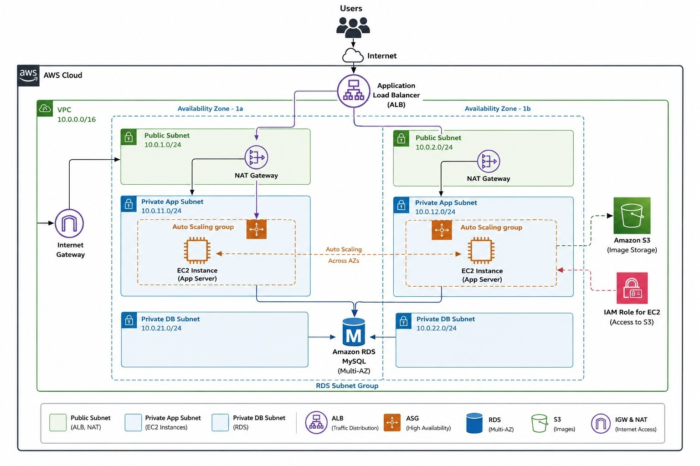

# Terraform AWS Highly Available Web Application

### 🚀 3-Tier Highly Available AWS Architecture
**Infrastructure as Code using Terraform**

## 📌 Overview

This project provisions a **highly available AWS web application infrastructure using Terraform (Infrastructure as Code)**.

The architecture is deployed across **two Availability Zones** to improve availability and fault tolerance. Application servers run in private subnets behind an **Application Load Balancer (ALB)** and **Auto Scaling Group (ASG)**, while the database uses **Amazon RDS for MySQL with Multi-AZ deployment**.

Terraform is used to provision and manage AWS resources consistently and repeatedly.

---

## 🏗️ Architecture



### Architecture Flow

Users → Internet → Application Load Balancer → EC2 Application Servers → RDS MySQL

EC2 Application Servers → Amazon S3

EC2 Application Servers → IAM Role

---

## ☁️ AWS Services Used

| Service | Purpose |
|---|---|
| **Amazon VPC** | Provides isolated networking |
| **Application Load Balancer** | Distributes incoming application traffic |
| **Amazon EC2** | Hosts application servers |
| **Auto Scaling Group** | Maintains application availability and scaling |
| **NAT Gateway** | Provides outbound internet access for private subnets |
| **Amazon RDS MySQL** | Managed relational database |
| **RDS Multi-AZ** | Provides database high availability |
| **Amazon S3** | Stores application images |
| **IAM Role** | Grants EC2 permission to access S3 |
| **Internet Gateway** | Provides internet connectivity |

---

## 🌐 Network Design

The VPC uses:

```text
VPC: 10.0.0.0/16
````

### Availability Zone 1a

```text
Public Subnet       → 10.0.1.0/24
Private App Subnet  → 10.0.11.0/24
Private DB Subnet   → 10.0.21.0/24
```

### Availability Zone 1b

```text
Public Subnet       → 10.0.2.0/24
Private App Subnet  → 10.0.12.0/24
Private DB Subnet   → 10.0.22.0/24
```

### Subnet Purpose

* **Public Subnets** → ALB and NAT Gateway
* **Private App Subnets** → EC2 application servers
* **Private DB Subnets** → RDS MySQL

---

## 🔄 Application Traffic Flow

1. User sends a request through the Internet.
2. Request reaches the **Application Load Balancer**.
3. ALB distributes traffic across EC2 instances.
4. EC2 instances run inside private application subnets.
5. Application servers communicate with **Amazon RDS MySQL**.
6. EC2 instances use an **IAM Role** to access images stored in S3.
7. NAT Gateway provides outbound internet connectivity for private resources.

---

## 🚀 Why Terraform?

Terraform allows the AWS infrastructure to be defined and managed as **Infrastructure as Code (IaC)**.

### Benefits

* ♻️ Reusable infrastructure
* 🔁 Consistent deployments
* 📦 Infrastructure version control
* ⚡ Faster provisioning
* 🔍 Preview changes using `terraform plan`
* 📈 Scalable infrastructure
* 🧹 Easy infrastructure removal

---

## 📁 Project Structure

```text
terraform-proj/
│
├── main.tf
├── provider.tf
├── variables.tf
├── outputs.tf
├── terraform.tfvars
├── versions.tf
├── .gitignore
│
└── docs/
    └── architecture.png
```

---

## ⚙️ Prerequisites

Before deploying the project, install:

* Terraform
* AWS CLI
* AWS Account
* AWS credentials

Check Terraform:

```bash
terraform version
```

Check AWS CLI:

```bash
aws --version
```

Configure AWS credentials:

```bash
aws configure
```

---

## 🛠️ Terraform Deployment

### 1. Clone the Repository

```bash
git clone https://github.com/vijayaawss/terraform-proj.git
cd terraform-proj
```

### 2. Initialize Terraform

```bash
terraform init
```

### 3. Validate Configuration

```bash
terraform validate
```

### 4. Format Terraform Files

```bash
terraform fmt
```

### 5. Review the Plan

```bash
terraform plan
```

### 6. Deploy Infrastructure

```bash
terraform apply
```

Enter:

```text
yes
```

when prompted.

---

## 🔎 Verify Deployment

After deployment, verify that:

* VPC and subnets are created
* ALB is active
* EC2 instances are running
* EC2 instances are distributed across two Availability Zones
* Auto Scaling Group is healthy
* RDS MySQL is available
* RDS is configured for Multi-AZ
* EC2 can access required S3 objects
* Application traffic reaches EC2 through the ALB

---

## 🧹 Destroy Infrastructure

To remove the Terraform-managed infrastructure:

```bash
terraform destroy
```

Enter:

```text
yes
```

> ⚠️ Use this command carefully because it can remove resources including databases.

---

## 🔐 Security

* EC2 instances are deployed in private subnets.
* RDS is deployed in private database subnets.
* Application traffic is handled through the ALB.
* EC2 uses an IAM Role instead of storing AWS access keys.
* Database access should be restricted to the application tier.
* Sensitive credentials should not be committed to GitHub.

### `.gitignore`

```gitignore
.terraform/
*.tfstate
*.tfstate.*
crash.log
*.tfvars
*.tfvars.json
```

---

## 🎯 Key Project Highlights

* Infrastructure provisioned using **Terraform**
* AWS VPC with public and private subnet separation
* Multi-AZ architecture
* Application Load Balancer
* EC2 Auto Scaling Group
* Private application servers
* Amazon RDS MySQL Multi-AZ
* Amazon S3 image storage
* IAM Role-based EC2 access to S3
* NAT Gateway
* Infrastructure as Code deployment

---
## 🔮 Future Enhancements

- Implement **Amazon CloudWatch** for application and infrastructure monitoring.
- Add **AWS WAF** for enhanced web application security.
- Implement **HTTPS/SSL** using AWS Certificate Manager.
- Add **Route 53** for domain management and DNS routing.
- Introduce **CI/CD pipeline** using AWS CodePipeline and CodeBuild.
- Add **AWS Secrets Manager** for secure database credential management.
- Enable automated **backup and disaster recovery** strategies.
- Implement advanced **Auto Scaling policies** based on application traffic and resource utilization.
- Add centralized logging and monitoring for better troubleshooting.

## 👨‍💻 Author

**Vijaya**

---
